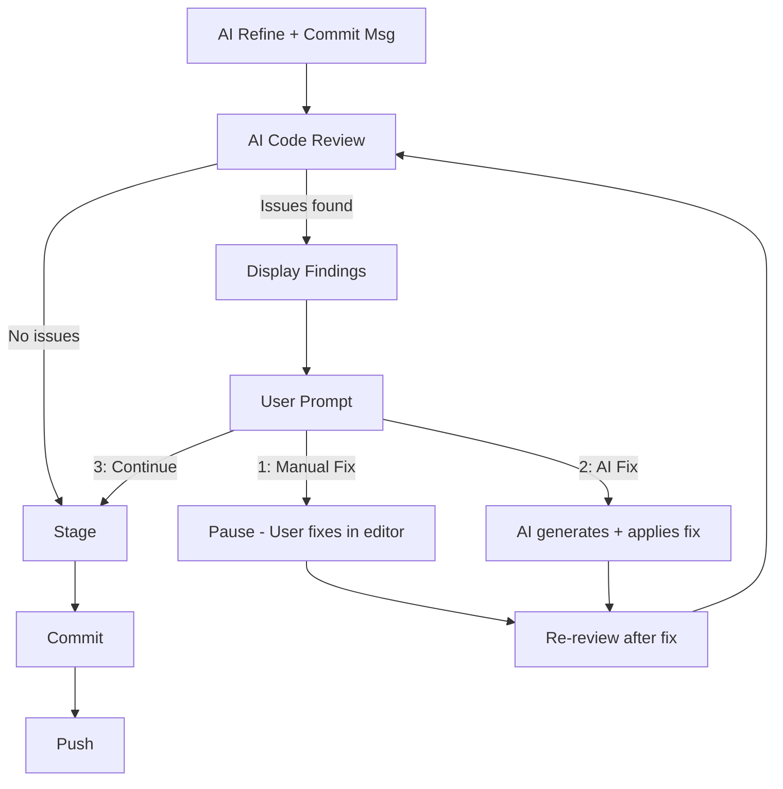

# AI Code Review Gate

## Current Flow


## Proposed Flow



## File Changes

### 1. New file: `[internal/ai/review.go](internal/ai/review.go)`

Define review types and the `ReviewCode` + `GenerateFix` methods:

- `**ReviewFinding**` struct: `File`, `Line` (int), `Severity` (error/warning/info), `Description`, `Suggestion` (AI's suggested fix)
- `**ReviewResult**` struct: `Findings []ReviewFinding`, `HasBlockers bool` (true if any severity == "error")
- `**ReviewCode(groups []grouper.FileGroup) (*ReviewResult, error)**` -- sends diffs to Claude with a code review prompt asking it to return JSON findings. Returns structured review results. Prompt instructs Claude to look for bugs, logic errors, security issues, and obvious mistakes.
- `**GenerateFix(filePath string, finding ReviewFinding, currentContent string) (string, error)**` -- sends the file content + finding to Claude, returns the corrected file content as a string. The engine will write this back to disk.

### 2. Modify: `[internal/ui/logger.go](internal/ui/logger.go)`

Add interactive UI methods:

- `**ReviewFindings(findings []ReviewFinding)**` -- renders findings in a styled, tree-like format with severity coloring (red for errors, yellow for warnings)
- `**PromptReviewAction() (string, error)**` -- displays the 3 options (`[1] Fix manually`, `[2] Let AI fix`, `[3] Continue anyway`) and reads user choice from stdin. Returns `"manual"`, `"aifix"`, or `"continue"`.
- `**WaitForManualFix() error**` -- prints instructions ("Fix the issues and press ENTER to re-review...") and blocks on stdin until ENTER
- `**AIFixApplied(file, description string)**` -- logs that an AI fix was applied to a file

The logger will need a `*bufio.Reader` field (reading from `os.Stdin`) to support interactive prompts.

### 3. Modify: `[internal/engine/engine.go](internal/engine/engine.go)`

Insert the review step into `processChanges()` between step 3 (AI refine) and step 4 (stage + commit):

```go
// 3.5 AI Code Review (new step)
reviewResult, err := e.ai.ReviewCode(refined)
if err != nil {
    e.logger.Warn("AI review failed, proceeding without review", "err", err)
} else if reviewResult.HasBlockers {
    // Display findings and prompt user
    action := e.handleReviewFindings(refined, reviewResult)
    if action was "manual" or "aifix", loop back to re-review
}
```

Add a new private method `handleReviewFindings(groups, reviewResult)` that:

1. Calls `logger.ReviewFindings()` to display issues
2. Calls `logger.PromptReviewAction()` to get user choice
3. If "manual": calls `logger.WaitForManualFix()`, then re-fetches diffs and re-reviews (loop)
4. If "aifix": reads file content, calls `ai.GenerateFix()`, writes the fix back to disk, then re-reviews (loop)
5. If "continue": returns and proceeds to stage/commit/push

The safety timer auto-flush path should skip interactive review (can't prompt without a user). Add a `interactive bool` field to Engine, set from `main.go`.

### 4. Modify: `[main.go](main.go)`

- Set `eng.Interactive = true` when running in daemon mode (user is at the terminal)
- The `pushCmd()` path (SIGUSR1 signal) will set `Interactive = false` so auto-flushes skip the review prompt

### 5. Modify: `[internal/config/config.go](internal/config/config.go)`

Add `CodeReview bool` field to `AIConfig` (default: `true`), allowing users to disable AI review via `config.yaml` if desired:

```yaml
ai:
  code_review: true
```

## Key Design Decisions

- **Review happens per-group**: each group gets its own review since each becomes a separate commit. This keeps findings scoped and actionable.
- **Re-review loop**: after manual or AI fix, the diffs are re-fetched and reviewed again, so the user knows the fix resolved the issue.
- **Graceful fallback**: if the review API call fails, proceed without blocking (same pattern as existing `RefineAndCommit` fallback).
- **Max review iterations**: cap at 3 re-reviews per group to prevent infinite loops.
- **Non-interactive fallback**: safety timer auto-flushes and SIGUSR1 pushes skip interactive review (log warnings instead).
