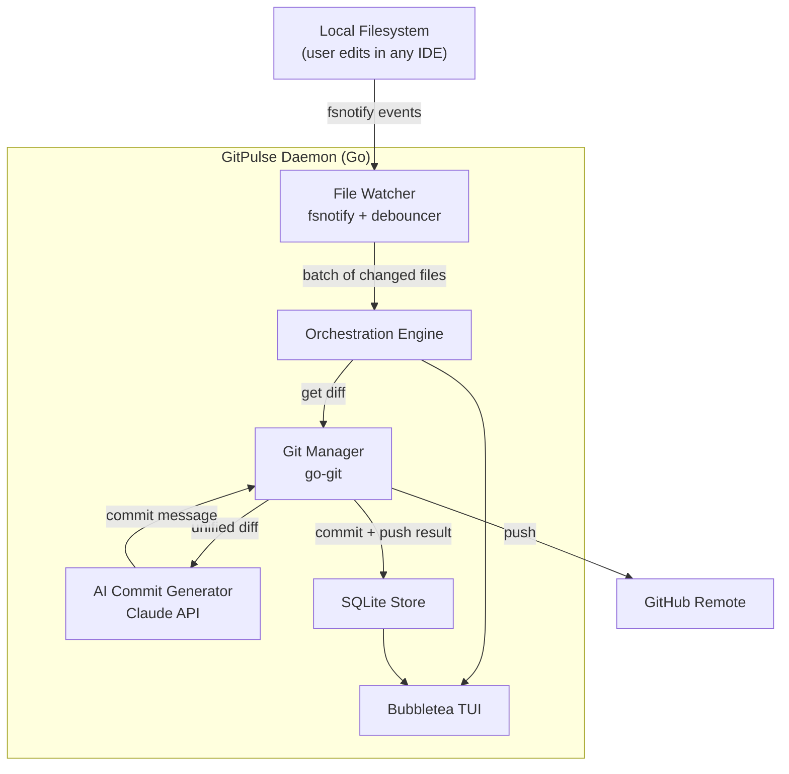

# GitPulse -- Agentic Git Workflow Engine

## Name: **GitPulse**

"Pulse" captures the dual meaning: it continuously monitors the _heartbeat_ of your codebase (file changes), and it _pulses_ intelligent commits upstream. Short, memorable, demo-friendly.

_Alternatives considered: Vigil, Kommit, GitSense_

---

## Architecture (MVP Scope)



The daemon is a single Go binary. The TUI runs in the foreground showing live status; the watcher, engine, AI, and git layers run as goroutines behind it.

---

## Tech Stack

- **Language:** Go 1.22+
- **File watching:** `github.com/fsnotify/fsnotify`
- **Git operations:** `github.com/go-git/go-git/v5`
- **AI:** Anthropic Claude API via `net/http` (no SDK needed)
- **TUI:** `github.com/charmbracelet/bubbletea` + `lipgloss` + `bubbles`
- **Persistence:** `modernc.org/sqlite` (pure-Go SQLite, no CGo)
- **Config:** `gopkg.in/yaml.v3`

---

## Project Structure

```
gitpulse/
├── main.go                    # Entry point, flag parsing, wire everything up
├── go.mod / go.sum
├── config.yaml                # User-editable settings
├── internal/
│   ├── config/
│   │   └── config.go          # Parse YAML config
│   ├── watcher/
│   │   └── watcher.go         # fsnotify wrapper + debounce timer
│   ├── git/
│   │   └── git.go             # Open repo, stage, diff, commit, push
│   ├── ai/
│   │   └── claude.go          # Claude HTTP client, prompt builder, response parser
│   ├── engine/
│   │   └── engine.go          # Orchestrator: watcher -> diff -> AI -> commit -> push
│   ├── store/
│   │   └── store.go           # SQLite: save commits, query history
│   └── tui/
│       ├── model.go           # Bubbletea model (state)
│       ├── update.go          # Bubbletea update (event handling)
│       └── view.go            # Bubbletea view (render)
└── ACTIVITY_LOG.md
```

---

## Component Details

### 1. File Watcher (`internal/watcher/`)

- Use `fsnotify` to recursively watch the target directory.
- **Debounce logic:** After the first change event, start a configurable timer (default 30s). Reset it on each subsequent event. When timer fires, emit a `ChangeSet` (list of changed file paths + operation type) to a Go channel.
- Respect `.gitignore` patterns -- skip events for ignored files (parse `.gitignore` or shell out to `git check-ignore`).
- Key types: `Watcher` struct, `ChangeSet` struct, `Events chan ChangeSet`.

### 2. Git Manager (`internal/git/`)

- Use `go-git` to:
  - Open existing repo at the target path.
  - `git add` changed files from the `ChangeSet`.
  - Generate a **unified diff** of staged changes (for sending to AI).
  - Create a commit with the AI-generated message.
  - Push to the configured remote/branch.
- Fallback: if `go-git` push auth is tricky, shell out to `git push` via `os/exec` (pragmatic hackathon move).
- Key functions: `OpenRepo`, `StageFiles`, `GetStagedDiff`, `Commit`, `Push`.

### 3. AI Commit Message Generator (`internal/ai/`)

- Direct HTTP calls to `https://api.anthropic.com/v1/messages`.
- **Prompt template:** Send the unified diff + list of changed files + instruction to produce a Conventional Commits message (`type(scope): description`).
- Parse the JSON response, extract the text content.
- Truncate diff to ~3000 chars if it exceeds Claude's practical context for good results (keep it focused).
- API key from env var `ANTHROPIC_API_KEY` or config.
- Key types: `ClaudeClient`, method `GenerateCommitMessage(diff string, files []string) (string, error)`.

### 4. Orchestration Engine (`internal/engine/`)

- Goroutine that reads from the watcher's `ChangeSet` channel in a loop:
  1. Receive `ChangeSet`
  2. Call `git.StageFiles(changeset.Files)`
  3. Call `git.GetStagedDiff()`
  4. Call `ai.GenerateCommitMessage(diff, files)`
  5. Call `git.Commit(message)`
  6. Call `git.Push()`
  7. Call `store.SaveCommit(...)` to persist to SQLite
  8. Send a `CommitEvent` to the TUI via a channel
- Each step emits status updates to the TUI channel so the user sees real-time progress.
- Error handling: if any step fails, log it, send error status to TUI, skip to next cycle.

### 5. SQLite Store (`internal/store/`)

Minimal schema for MVP (2 tables):

```sql
CREATE TABLE commits (
    id    INTEGER PRIMARY KEY AUTOINCREMENT,
    hash  TEXT,
    message TEXT,
    files_changed INTEGER,
    additions INTEGER,
    deletions INTEGER,
    ai_generated BOOLEAN DEFAULT TRUE,
    pushed BOOLEAN DEFAULT FALSE,
    created_at DATETIME DEFAULT CURRENT_TIMESTAMP
);

CREATE TABLE events (
    id    INTEGER PRIMARY KEY AUTOINCREMENT,
    type  TEXT,
    detail TEXT,
    created_at DATETIME DEFAULT CURRENT_TIMESTAMP
);
```

### 6. Bubbletea TUI (`internal/tui/`)

Layout (single screen, split into regions using lipgloss):

```
┌──────────────────────────────────────────────┐
│  GITPULSE v0.1       Status: WATCHING        │
│  Repo: /Users/you/project   Branch: main     │
├──────────────────────────────────────────────┤
│  LIVE ACTIVITY                                │
│  > Watching for changes...                   │
│  > Change detected: src/auth.go, src/util.go │
│  > Waiting 30s for more changes... (12s)     │
│  > Generating commit message via Claude...   │
│  > Committed: feat(auth): add JWT refresh    │
│  > Pushed to origin/main                     │
├──────────────────────────────────────────────┤
│  RECENT COMMITS                              │
│  abc1234  feat(auth): add JWT refresh     2m │
│  def5678  fix(db): close idle connections 8m │
│  ghi9012  docs: update README            15m │
├──────────────────────────────────────────────┤
│  [P]ause  [R]esume  [C]onfig  [Q]uit        │
└──────────────────────────────────────────────┘
```

- **Model:** daemon status, activity log (ring buffer of last ~50 lines), recent commits list, config state.
- **Messages:** `ChangeDetectedMsg`, `DebouncingMsg`, `CommitCreatedMsg`, `PushCompleteMsg`, `ErrorMsg` -- sent from the engine goroutine.
- **Keybindings:** `p` pause watching, `r` resume, `q` quit, `c` toggle config view.

### 7. Config (`config.yaml`)

```yaml
watch_path: "."
debounce_seconds: 30
auto_push: true
remote: "origin"
branch: "main"
ai:
  provider: "claude"
  model: "claude-sonnet-4-20250514"
ignore_patterns:
  - "*.log"
  - "node_modules/"
  - ".git/"
  - "vendor/"
```

---

## 12-Hour Schedule

| Hours | Milestone | What to build |
| ----- | --------- | ------------- |

**Hours 1-2: Skeleton + File Watcher**

- `go mod init`, install all deps, scaffold directory structure
- Implement `watcher.go` with fsnotify + debounce channel
- Test: save a file, see the debounced event fire

**Hours 3-4: Git Manager**

- Implement `git.go`: open repo, stage, diff, commit
- Wire up: watcher event triggers stage + commit with a placeholder message
- Test: edit a file, see an auto-commit appear in `git log`

**Hours 5-6: Claude AI Integration**

- Implement `claude.go`: HTTP client, prompt builder, response parser
- Replace placeholder commit message with AI-generated one
- Test: edit a file, see a smart commit message in `git log`

**Hours 7-8: Engine + Push + Store**

- Implement `engine.go` orchestrator goroutine
- Add `git push` support
- Implement SQLite store, save commit records
- Test: full cycle from edit to push

**Hours 9-10: Bubbletea TUI**

- Implement TUI model/update/view
- Wire engine events to TUI messages
- Add keybindings (pause/resume/quit)
- Style with lipgloss

**Hours 11: Integration + Edge Cases**

- Handle large diffs (truncation)
- Handle network errors (push fails gracefully)
- Handle .gitignore filtering
- Test full end-to-end flow

**Hour 12: Polish + Demo Prep**

- Write README with setup instructions
- Record demo flow
- Final ACTIVITY_LOG.md update

---

## Key Design Decisions

- **go-git over shelling out to git**: Gives us programmatic access to diffs and staging without parsing CLI output. Exception: push auth may require `os/exec` fallback if SSH key handling is tricky in go-git.
- **Pure-Go SQLite (`modernc.org/sqlite`)** over CGo-based `mattn/go-sqlite3`: Zero CGo means `go build` just works everywhere, no C compiler needed.
- **Single binary**: Everything (watcher, engine, AI, TUI, DB) runs in one process. Goroutines handle concurrency. No microservices overhead for a hackathon.
- **Channel-based architecture**: Watcher -> Engine -> TUI communication all via typed Go channels. Clean, idiomatic, easy to reason about.

---

## Risk Mitigations

- **go-git push auth issues**: If SSH/HTTPS auth is painful, fall back to `exec.Command("git", "push")` immediately. Don't burn time on it.
- **Claude API rate limits or errors**: Cache last-known-good commit message format. If AI fails, fall back to an auto-generated message like `chore: auto-commit N files changed`.
- **Large repos / too many events**: The debouncer + .gitignore filtering handles this. Cap the diff sent to Claude at 4000 chars.
- **TUI complexity**: Start with a minimal view (just a scrolling log). Add the fancy layout in hour 10 only if on schedule.
